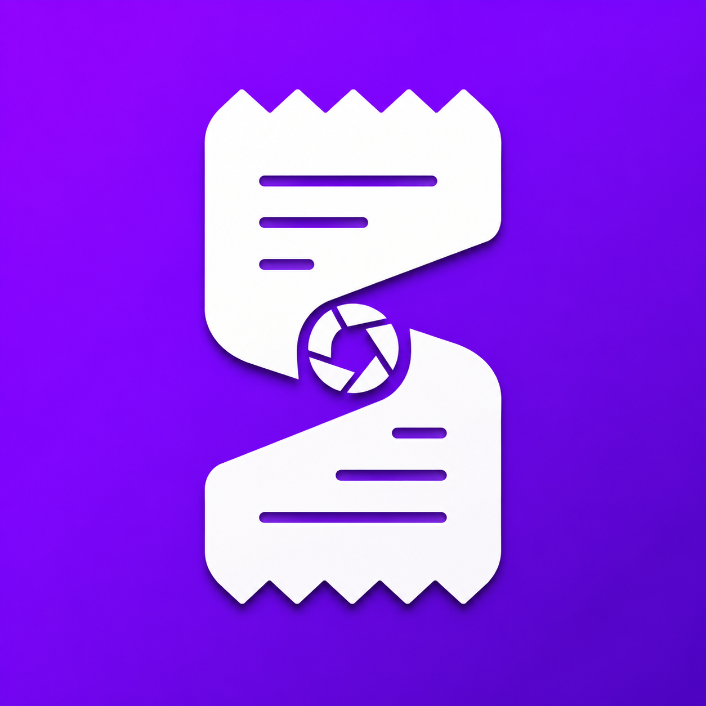

<div align="center">
  
  <h1>SplitSnap — Shared expense tracking for groups</h1>
  <a href="https://apple.co/3PWAfUo">
    
  </a>
</div>

<br>
<p align="center">
  
  
  
  
  
  
  
</p>
<br>

## Project Tracking

**Primary tracking document:** [`ROADMAP.md`](ROADMAP.md) — weekly progress, notes, embedded screenshots, and video links

**Screenshots:** PNGs are organized by week under [`docs/roadmap-screenshots/`](docs/roadmap-screenshots/) (same images as in the roadmap; useful for quick browsing in the repo or on GitHub).

## Weekly Progress Videos

**Playlist (all weeks):** [YouTube playlist](https://youtube.com/playlist?list=PLfh_d_SOW477Ie0rM6Yj5QWix_al3jvDc&si=DfWwp8XzHfQsel_b)

[Week 1](https://youtu.be/uZ3RfGsreec?si=huxHxwlchSmuWuN4) • [Week 2](https://youtu.be/ErOGMI0s7SE) • [Week 3](https://youtu.be/WzUGQyE3S0g) • [Week 4](https://youtu.be/bfmGb2MThas) • [Week 5](https://youtu.be/tjnbJSpax2M)  
[Week 6](https://youtu.be/FsKxH_ItLFo) • [Week 7](https://youtu.be/hHDUEYARdsk) • [Week 8](https://youtu.be/fyO_hSsueec) • [Week 9](https://youtu.be/fsI8G6Z_4Z8) • [Week 10](https://youtu.be/Pwte_m7p3B4)


## Key Features

<div>
  
  <h3>🏘 Groups & Shared Expenses</h3>
  <p>Create groups with your friends, roommates, or travel buddies. Track all shared expenses instantly from a single screen. Say goodbye to complicated math!</p>
</div>
<br clear="both"/>
<br>

<div>
  
  <h3>📸 AI-Powered Receipt Scanning</h3>
  <p>Snap a photo of your receipt or pick one from your gallery. Thanks to AI integration, the expense amount, date, and merchant name are filled in automatically.</p>
</div>
<br clear="both"/>
<br>

<div>
  
  <h3>💸 Fair & Flexible Splitting</h3>
  <p>Split expenses equally among group members or enter exact amounts manually. Our interface calculates the remaining balance in real-time, leaving zero room for error!</p>
</div>
<br clear="both"/>
<br>

<div>
  
  <h3>📊 Detailed Settlement Summary</h3>
  <p>"Who owes whom, and how much?" Get the answer on a single screen. Our algorithm minimizes the debt network, ensuring you settle up with the fewest possible transactions.</p>
</div>
<br clear="both"/>
<br>

<div>
  
  <h3>🌙 Dark Mode</h3>
  <p>A flawless dark mode experience that is easy on the eyes and seamlessly synchronizes with your system theme.</p>
</div>
<br clear="both"/>

## Requirements

- **Node.js** 20.19+ (Expo SDK 56)
- **macOS + Xcode** for iOS Simulator
- **Supabase** project (URL + publishable/anon key)

## Setup

1. **Install dependencies**

   ```bash
   npm install
   ```

2. **Environment**

   Copy `.env.example` to `.env` and fill in:

   - `EXPO_PUBLIC_SUPABASE_URL`
   - `EXPO_PUBLIC_SUPABASE_KEY`

   Never commit `.env`.

3. **Supabase database (optional but required for real groups/friends)**

   If you use the linked Supabase project and [CLI](https://supabase.com/docs/guides/cli):

   ```bash
   supabase db push
   ```

   Migrations live under [`supabase/migrations/`](supabase/migrations/). See [`supabase/README.md`](supabase/README.md) for archive/`pg_cron` notes and RPC summary. Schema reference: [`docs/DATABASE.md`](docs/DATABASE.md).

4. **Run on iOS (development build)**

   This project uses **native modules** (e.g. MMKV). Use a **development build**, not Expo Go:

   ```bash
   npm run ios
   ```

   Or: `npx expo run:ios`

   First run generates native projects via prebuild (if `ios/` is ignored in git, this is expected on each fresh clone). The same flow works on a **physical iPhone** (USB or network) with a dev client — not Expo Go.

## Learn more

- [Expo documentation](https://docs.expo.dev/)
- [Expo Router](https://docs.expo.dev/router/introduction/)
- [Supabase + Expo](https://supabase.com/docs/guides/getting-started/tutorials/with-expo-react-native)

## Contact

**Developer:** Bora Kocabıyık  
**Email:** borakocabiyik@hotmail.com  
**Website:** [splitsnap.borak.dev](https://splitsnap.borak.dev)  

If you have any questions, feedback, or need support, feel free to reach out via email or open an `Issue` in this repository.

## License

This project is licensed under the [MIT License](LICENSE).
