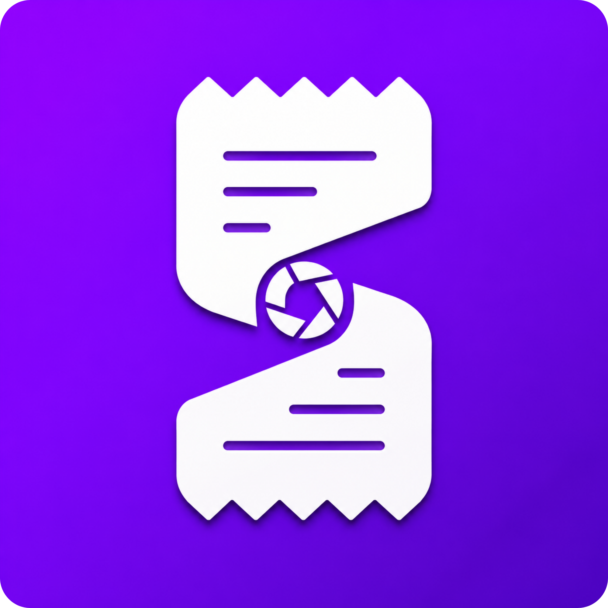
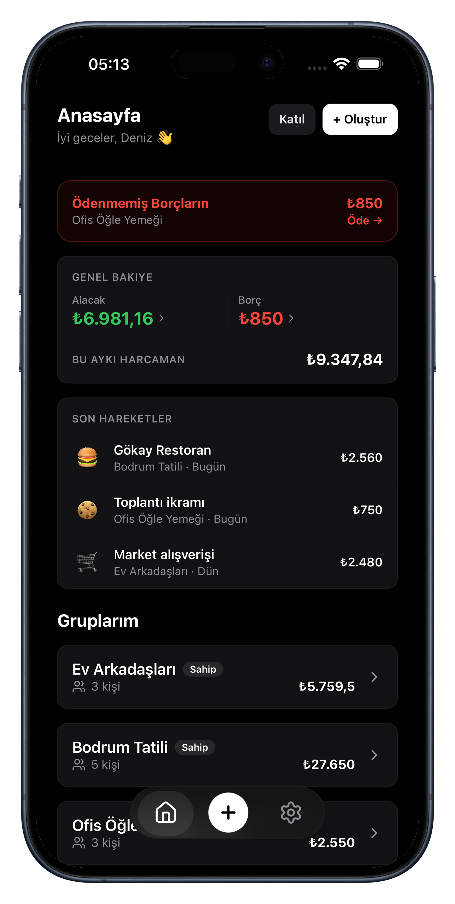
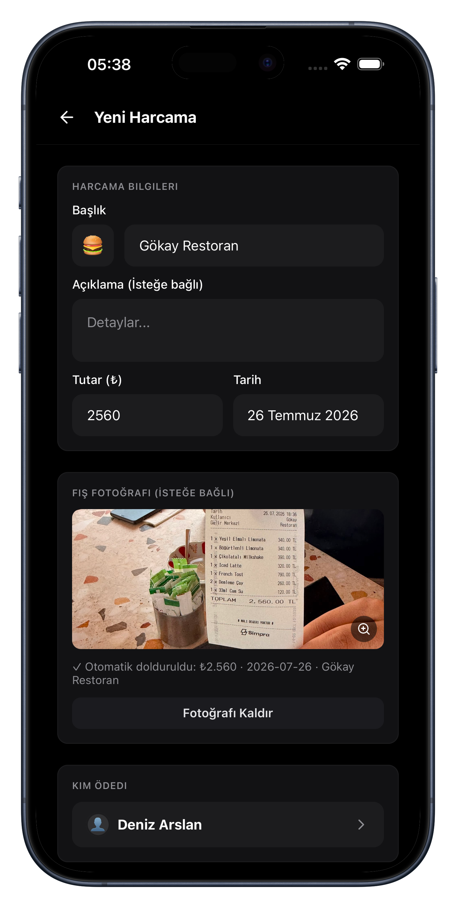
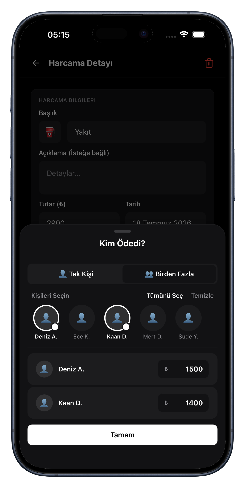
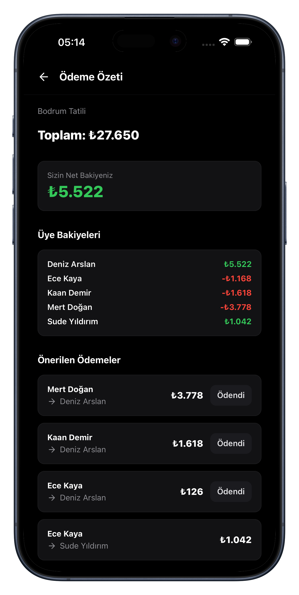

<div align="center">
  
  <h1>
    SplitSnap<br>
    <sub>Snap receipts. Split bills. Settle up effortlessly.</sub>
  </h1>
  <br>
  <a href="https://apple.co/3PWAfUo">
    
  </a>
</div>

<br>
<p align="center">
  
  
  
  
  
  
  
</p>
<br>

## Project Tracking

- **Primary Document:** [`ROADMAP.md`](ROADMAP.md) — post-release backlog, active tasks, and recent updates.
- **Archived School Project:** [School Archive](docs/archive/school/) & [Screenshots](docs/archive/roadmap-screenshots/) (Final report, logs, videos).


## Key Features

<div>
  
  <br><br><br>
  <h3>🏘 Groups & Shared Expenses</h3>
  <p>Create groups with your friends, roommates, or travel buddies. The home screen opens on a single summary: what you are owed, what you owe, how much you have spent this month, and the latest activity across every group. Tap a balance to see exactly which groups it came from.</p>
</div>
<br clear="both"/>
<br>

<div>
  
  <br><br><br>
  <h3>📸 AI-Powered Receipt Scanning</h3>
  <p>Snap a photo of your receipt or pick one from your gallery. The text is read on device, then an AI pass fills in the amount, date, and merchant name for you. If an image turns out not to be a readable receipt, the app tells you instead of quietly guessing.</p>
</div>
<br clear="both"/>
<br>

<div>
  
  <br><br><br>
  <h3>💸 Fair & Flexible Splitting</h3>
  <p>Split an expense equally or type exact amounts per person. When more than one person chipped in, record every payer on the same expense instead of faking it with a second entry. The remaining balance updates as you type, so a split can never quietly fail to add up.</p>
</div>
<br clear="both"/>
<br>

<div>
  
  <br><br><br>
  <h3>📊 Detailed Settlement Summary</h3>
  <p>"Who owes whom, and how much?" Get the answer on a single screen. Our algorithm minimizes the debt network, ensuring you settle up with the fewest possible transactions, and tapping any line opens the full breakdown behind it.</p>
</div>
<br clear="both"/>
<br>

<div>
  
  <br><br><br>
  <h3>🌗 Light & Dark</h3>
  <p>Both themes are built as first-class citizens rather than one being an afterthought, and the app follows your system setting automatically.</p>
</div>
<br clear="both"/>

## Requirements

- **Node.js** as pinned in [`.nvmrc`](.nvmrc). That single file is what local shells, the iOS build and EAS Build all read, and `engines` plus `engine-strict` in [`.npmrc`](.npmrc) turn a mismatch into a failed `npm install` rather than a warning. Expo SDK 57 itself only needs 20.19+; the tighter pin is what keeps release builds reproducible.
- **macOS + Xcode** for iOS Simulator
- **Supabase** project (URL + publishable/anon key)

## Setup

1. **Install dependencies**

   ```bash
   nvm use        # or: fnm use — reads .nvmrc
   npm install
   ```

   The first line is not optional: `npm install` refuses to run on a Node version outside the pin.

2. **Environment**

   Copy `.env.example` to `.env` and fill in:

   - `EXPO_PUBLIC_SUPABASE_URL`
   - `EXPO_PUBLIC_SUPABASE_KEY`

   Never commit `.env`.

3. **Supabase backend & AI Functions**

   To set up the database schema and deploy the AI receipt scanning edge functions, use the [Supabase CLI](https://supabase.com/docs/guides/cli):

   ```bash
   supabase db push
   supabase functions deploy
   ```

   *Note: For the receipt parsing feature to work, you must set your OpenAI API key as a Supabase secret:*
   ```bash
   supabase secrets set OPENAI_API_KEY=your_api_key_here
   ```

   Migrations live under [`supabase/migrations/`](supabase/migrations/). See [`supabase/README.md`](supabase/README.md) for archive/`pg_cron` notes and RPC summary. Schema reference: [`docs/DATABASE.md`](docs/DATABASE.md).

4. **Run on iOS (development build)**

   This project uses **native modules** (e.g. MMKV). Use a **development build**, not Expo Go:

   ```bash
   npm run ios
   ```

   Or: `npx expo run:ios`

   First run generates native projects via prebuild (if `ios/` is ignored in git, this is expected on each fresh clone). Prebuild also writes `ios/.xcode.env.local` via [`plugins/withXcodeEnvNvm.js`](plugins/withXcodeEnvNvm.js), which is how Xcode's script phases find the `.nvmrc` Node — nothing to set up by hand. The same flow works on a **physical iPhone** (USB or network) with a dev client — not Expo Go.

   To choose a target, use `npm run ios:26` or `npm run ios:27` for a specific iOS runtime, or `npm run ios:pick` for a prompt. All three stay on the stable toolchain; only deploying to a device running an **iOS beta** needs `npm run ios:device`, which points the build at `Xcode-beta.app` through `DEVELOPER_DIR`. See [`docs/DEVELOPMENT_WORKFLOW.md`](docs/DEVELOPMENT_WORKFLOW.md) for the toolchain split, why the simulator runtime is independent of the SDK, and how to clear the build cache when switching between simulator and device.

## Learn more

- [Expo documentation](https://docs.expo.dev/)
- [Expo Router](https://docs.expo.dev/router/introduction/)
- [Supabase + Expo](https://supabase.com/docs/guides/getting-started/tutorials/with-expo-react-native)

## Contact

**Developer:** Bora Kocabıyık  
**Email:** bora@borak.dev  
**Website:** [splitsnap.borak.dev](https://splitsnap.borak.dev)  

If you have any questions, feedback, or need support, feel free to reach out via email or open an `Issue` in this repository.

## License

This project is licensed under the [MIT License](LICENSE).
