# SplitSnap - Yol Haritası

> Bu doküman, proje sürecini hafta hafta takip etmek için kullanılmaktadır.
> Haftalık ilerleme, video bağlantıları ve ekran görselleri ilgili haftaların altında paylaşılmaktadır.
> Proje planı, `docs/archive/SplitSnap Tanıtım Raporu.md` dönem başı teslim edilen proje tanıtım raporu içeriğiyle uyumlu şekilde korunmuştur.

## Hafta 1 — Proje Kurulumu ve Temel Yapı

- [x] Proje konusunun netleştirilmesi
- [x] GitHub deposunun oluşturulması
- [x] React Native + TypeScript proje kurulumunun yapılması
- [x] Temel klasör yapısının oluşturulması
- [x] Navigation yapısının ilk kurulumu
- [x] Figma üzerinde ilk ekran taslaklarının hazırlanması
- [x] Açılış, giriş ve kayıt ekranlarının ilk sürümünün yapılması

### Ekstra

- [x] Expo SDK 55 + `default@sdk-55` şablonu ile proje oluşturulması (Expo Router, `src/app/`)
- [x] Supabase istemcisi için paketler ve ortam değişkenleri (`.env` / `.env.example`)
- [x] Zustand, react-native-mmkv, react-native-nitro-modules, expo-secure-store, expo-image-picker kurulumu
- [x] İlk iOS development build (`expo run:ios`) ve `expo-doctor` doğrulaması
- [x] `README.md`, `docs/AGENTS.md`, `docs/PROGRESS.md` ve arşiv rapor yolu güncellemeleri
- [x] `design/figma_template/` + `design/figma_screenshots/` — Figma çıktısına uygun referans UI (Vite/React prototip: Login, Register, grup/harcama sayfaları, tema dosyaları)

### Haftalık Notlar

- İlerlemeyi bu dosya üzerinden takip ediyorum. Haftalık maddeleri rapordaki planla uyumlu tutmaya çalışıyorum; tamamlanan işleri işaretliyor, plan dışı yapılanları ise Ekstra bölümünde topluyorum.
- Projede Expo SDK 55, Expo Router ve TypeScript kullanıyorum. Routing yapısı `src/app/` altında dosya tabanlı ilerliyor.
- Supabase paketi ve `.env` yapısı Hafta 1’de hazırdı; uygulama içi bağlantı, Auth ve tema Hafta 2’de (`ui-template`) tamamlandı — sırada grup listesi ve `main` ile birleştirme.
- MMKV gibi native modüller kullandığım için projeyi Expo Go yerine development build ile (`expo run:ios`) çalıştırıyorum.
- Başlangıçta Zustand, MMKV, AsyncStorage, `expo-image-picker` ve `expo-secure-store` kurulumlarını yaptım. Plan dışı kalan işler Ekstra bölümünde yer alıyor.
- Tasarım tarafında Figma’da oluşturduğum taslağı referans alıyorum. `design/figma_template/` altındaki yapıyı projeye implemente ederken ve tech stack hakkında bilgi toplarken yapay zekadan yararlandım; ancak çıkan içerikleri doğrudan kullanmak yerine düzenleyip projeye uyarladım. Başta oluşturduğum görseller de `design/figma_screenshots/` klasöründe bulunuyor.
- `main` branch'inde derlenebilir temel yapı ve dokümantasyonu korudum. `ui-template` dalında giriş/kayıt, Supabase Auth, oturum, Tamagui teması emülatörde çalışır hale getirildi. Bundan sonraki adım: `main` ile birleştirmek ve Hafta 2’de kalan grup listesi ekranını tamamlamak.

### Video Linki

[Hafta 1 — 23-03-2026](https://youtu.be/uZ3RfGsreec?si=huxHxwlchSmuWuN4)

### Ekran Görselleri

**Expo / geliştirme ortamı**

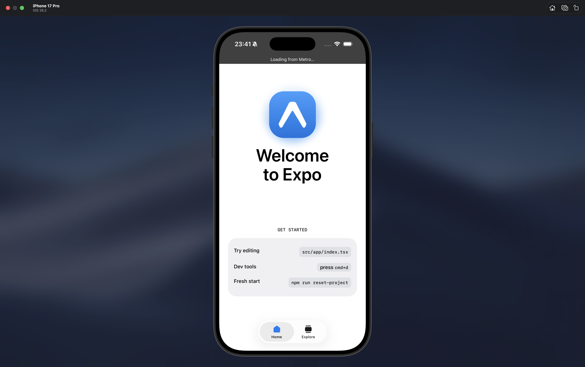

## Hafta 2 — Kimlik Doğrulama ve Tema

- [x] Supabase projesinin oluşturulması
- [x] Supabase Auth entegrasyonunun yapılması
- [x] Kullanıcı kayıt ve giriş akışının çalışır hale getirilmesi
- [x] Oturum yönetimi mantığının kurulması
- [x] Temel uygulama tema ve ortak bileşen yapısının oluşturulması
- [x] Grup listesi ekranının ilk sürümünün hazırlanması

### Ekstra

- [x] **Tamagui** tabanlı UI (provider, tema birleşimi, Inter font, Sheet modalları); kök `babel.config.js` ve `tamagui.config.ts`
- [x] **Sheet / portal:** `@tamagui/portal` tekilleştirme (`package.json` + overrides) — çift kopya `PortalDispatchContext` hatasını giderir
- [x] **`useTheme` + `getVariableValue`** — Lucide / native SVG için renk string çözümü
- [x] **Zustand + React 19:** `useGroupAggregates` / `useExpenseShares` ile stabil snapshot (sonsuz render döngüsü önlemi)
- [x] **Geliştirme ortamı:** Hafta 2’de `EXPO_PUBLIC_DEV_LOGIN_BYPASS` + mock giriş paneli vardı; **Hafta 3’te kaldırıldı** — artık yalnızca Supabase Auth
- [x] **Kalite komutları:** `npm run typecheck`, `lint:fix`, `check` (CI / commit öncesi)
- Expo uygulamasında `design/`’e paralel şablon/mock ekranlar ve yerel (Zustand) veri — haftalık rapor maddeleri değil; resmi maddeler yalnızca hedefe uygun tamamlandığında `[x]` (`docs/AGENTS.md`)

### Haftalık Notlar

### Video Linki

[Hafta 2 — 29-03-2026](https://youtu.be/ErOGMI0s7SE)

### Ekran Görselleri

**Giriş ekranı**

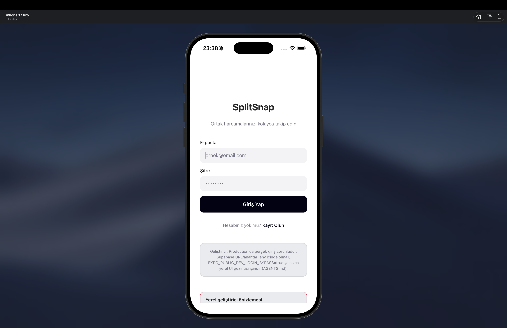

**Gruplar listesi (ana ekran)**

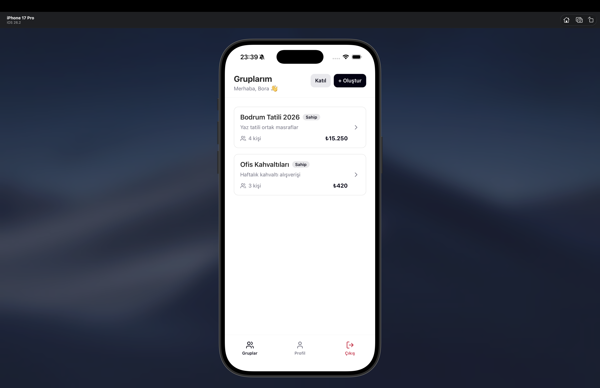

**Yeni grup oluşturma (alt sayfa / Sheet)**

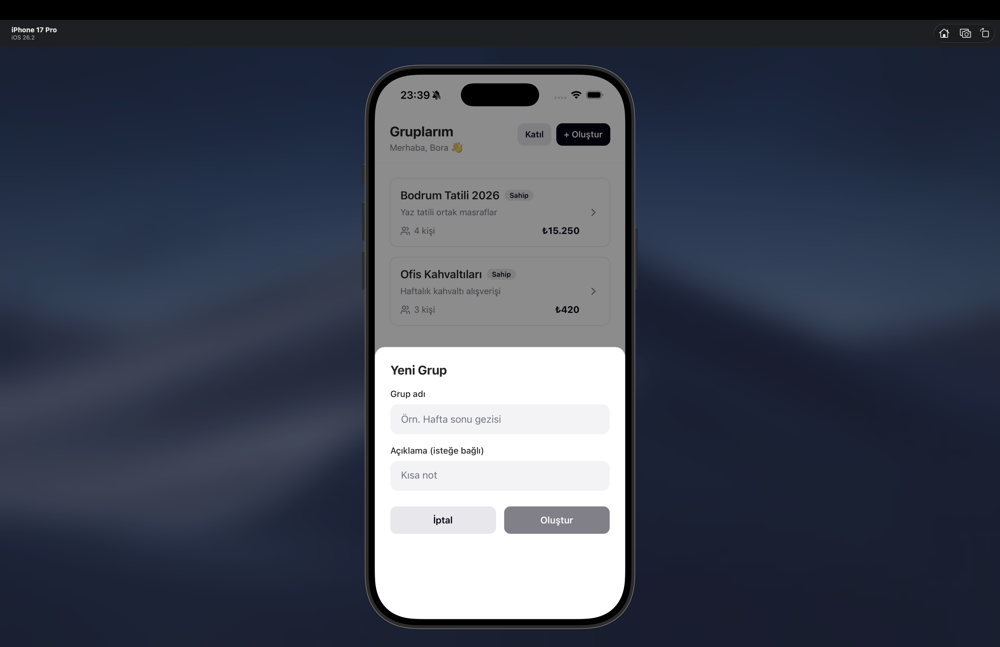

**Örnek harcama / grup akışı**

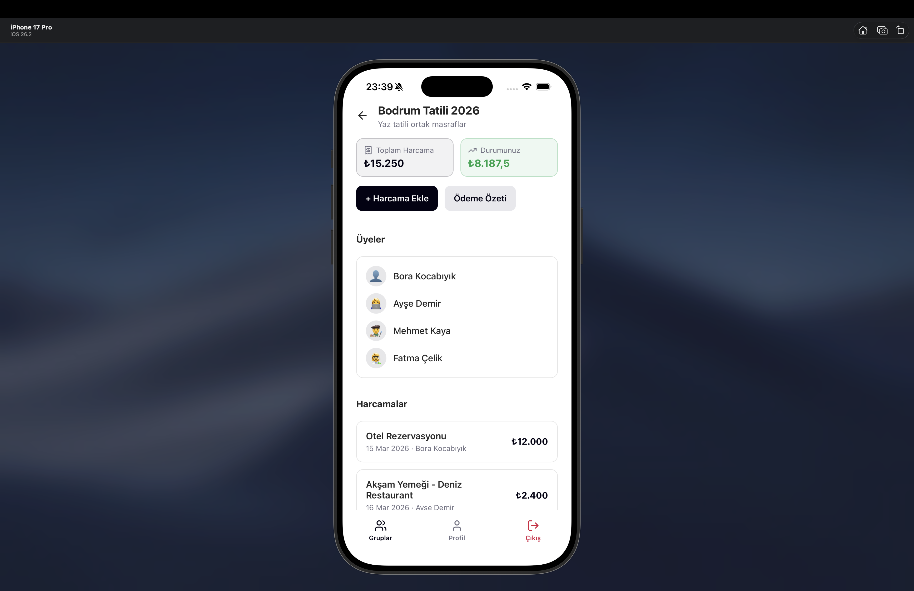

**Supabase — Authentication kullanıcıları**

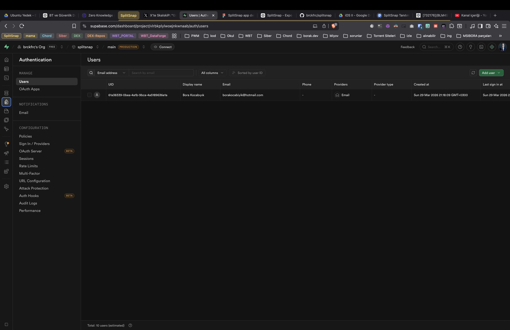

**Supabase — e-posta doğrulama**

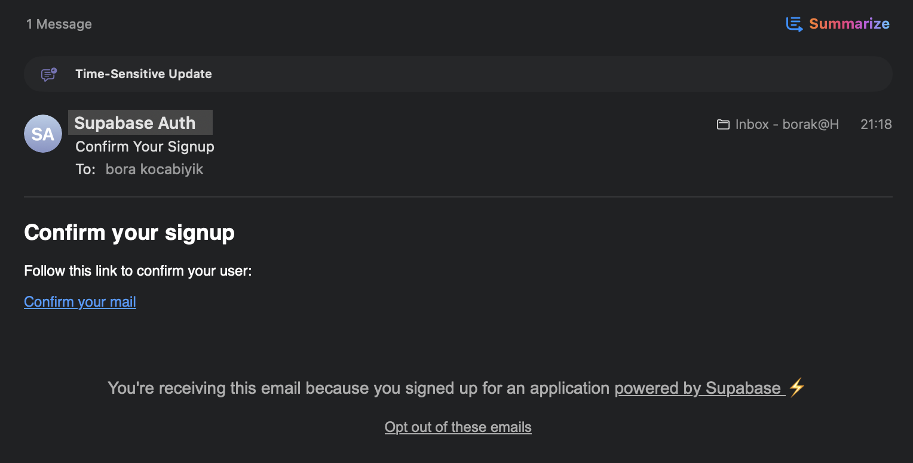

## Hafta 3 — Veritabanı ve Grup Yapısı

- [x] Veritabanı tablolarının planlanması
- [x] user/profile, group ve group_member yapılarının oluşturulması
- [x] Grup oluşturma ekranının yapılması
- [x] Gruba katılma mantığının tasarlanması
- [x] Kullanıcının dahil olduğu grupları listeleme

### Ekstra

- [x] **Supabase istemci:** `groups-supabase` (liste, oluştur, `join_group_by_invite` RPC), `groups-sync` (hibrit: tam yükleme + `groups` / `group_members` Realtime + AppState ile refetch sigortası)
- [x] **Dev login bypass kaldırıldı** — `EXPO_PUBLIC_DEV_LOGIN_BYPASS` / mock önizleme akışı yok; simülatörde de gerçek kayıt/giriş

### Haftalık Notlar

### Video Linki

[Hafta 3 — 11-04-2026](https://youtu.be/WzUGQyE3S0g)

### Ekran Görselleri

**Gruplar listesi**

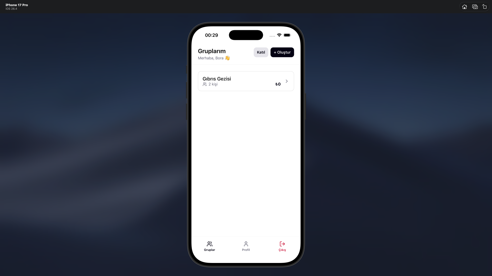

**Yeni grup oluşturma (Sheet)**

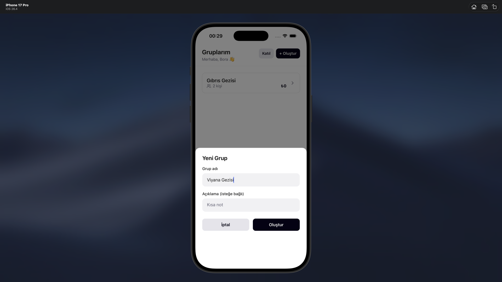

**Gruba katılma (Sheet)**

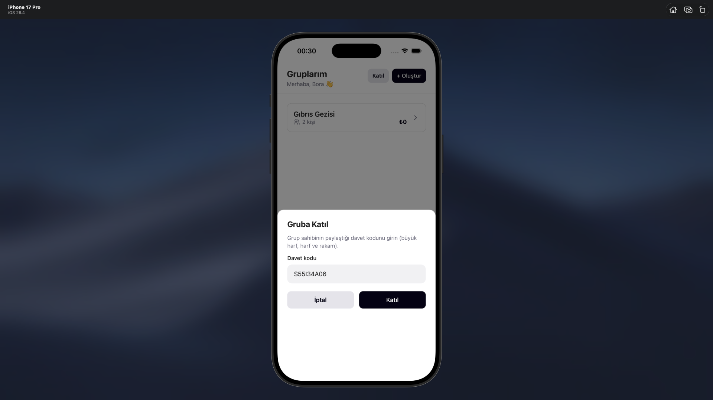

**Supabase — groups tablosu**

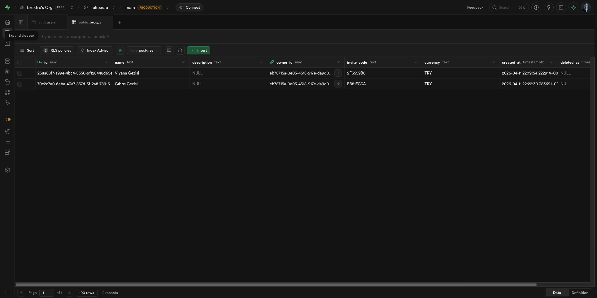

## Hafta 4 — Grup Detay ve Harcama Temeli

- [x] Group ve membership akışlarının backend ile tam bağlanması
- [x] Grup detay ekranının yapılması
- [x] Grup üyelerinin görüntülenmesi
- [x] Harcama ekranları için veri modellerinin hazırlanması
- [x] Harcama ekleme ekranının ilk sürümünün yapılması

### Ekstra

- [x] Grup detay üst bölümü: Toplam Harcama / Durumunuz kartlarıyla aynı iki sütun ızgarasında aksiyon butonları; solda Ödeme Özeti, sağda + Harcama Ekle
- [x] Grup sahibi için `#` ile davet kodu satırı ve `UserPlus` ile `Share.share` paylaşımı (üyelerde boş davet alanı yok)
- [x] **Gruplar listesi — toplam harcama:** Grup sync sonrası tüm grupların harcamalarının batch yüklenmesi; liste kartında ilk açılışta yanlış ₺0,00 kalmıyor (`groups-sync`, `fetchExpensesForGroupsPayload`, `replaceAllExpensesAndShares`)
- [x] **Yeni harcama formu (UX):** OS tarih seçici modal (`DatePickerModal`); manuel bölüşümde input içi “Kalan” ve tutar üst sınırı; ödeyen tek satır + değiştir; **önce** harcama bilgileri **altında** isteğe bağlı fiş fotoğrafı alanı
- [x] **Harcama düzenleme:** Tarih alanı için aynı OS tarih modalı (`edit` ekranı)

### Haftalık Notlar

### Video Linki

[Hafta 4 — 12-04-2026](https://youtu.be/bfmGb2MThas)

### Ekran Görselleri

**Grup detay — harcamalar listesi**

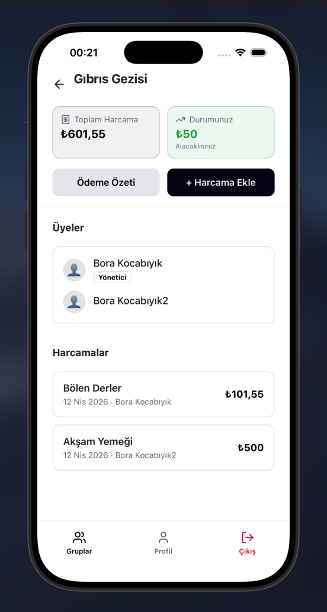

**Yeni harcama formu (üst kısım)**

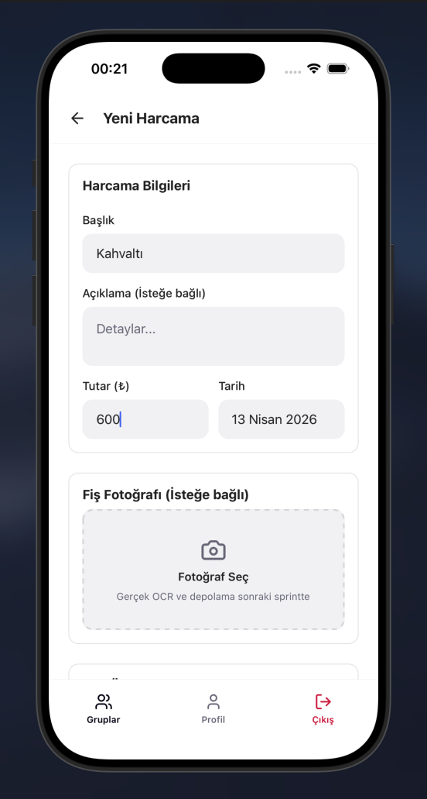

**Yeni harcama — eşit bölüşüm**

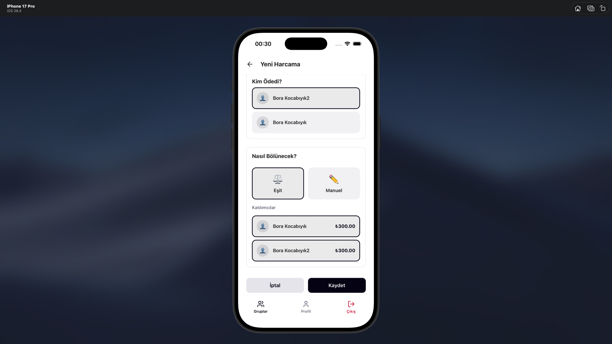

**Yeni harcama — manuel bölüşüm**

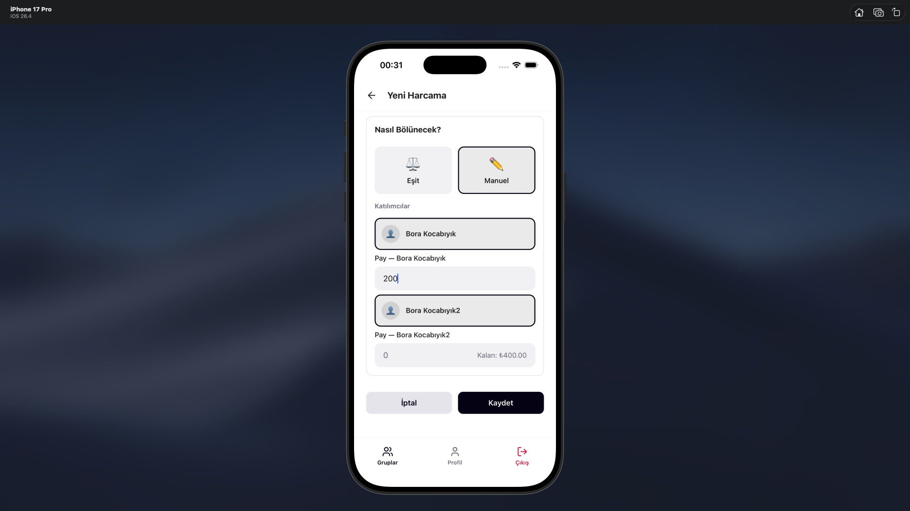

**Supabase — expenses tablosu**

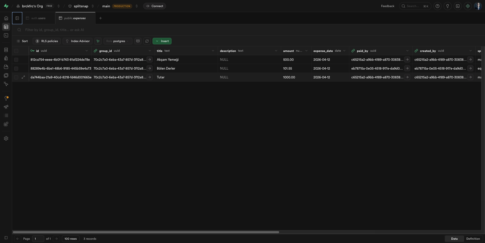

## Hafta 5 — Harcama Yönetimi

- [x] Harcama ekleme işleminin tamamlanması
- [x] Harcama düzenleme ve silme işlemlerinin eklenmesi
- [x] Ödeyen kişi ve katılımcı seçme yapısının kurulması
- [x] Eşit bölüşüm mantığının ilk sürümünün eklenmesi

#### Ekstra (Gelişmiş UX ve Finansal Tutarlılık)
- [x] **Pull-to-refresh**: Liste sayfalarında (gruplarım, harcamalarım) veriyi tazelemek için `RefreshControl` kullanımı.
- [x] **Toast bildirimleri**: Harcama başarıyla eklendiğinde/silindiğinde "Harcama eklendi" gibi zarif bildirimler.
- [x] **Client-side input validation**: Sadece backend'den dönen hatalar değil, "Boş başlık", "0'dan küçük tutar" durumlarında UI'ın anında kırmızı hata vermesi.
- [x] **Harcama düzenlemede manuel pay**: Başlangıçta manuel pay girilen harcamanın düzenleme ekranında da bu payların tekrar editlenebilmesi (şema ve UI senkronu).
- [x] **Boş durum (Empty state)**: Hiç harcama olmayan grupta "Henüz harcama yok, eklemek için tıkla" şeklinde güzel bir görsel yer tutucu.
- [x] **Kategori/Emoji**: Gelişmiş bir kategori ağacı yerine, harcamanın başına/sonuna ufak bir emoji seçici koyarak (🍔, 🚕, 🛒) harcama türünün görsel olarak ayırt edilmesi.)
- [x] **Durumunuz kartı açıklama satırı:** Grup detayda bakiye tutarının altına "Alacaklısınız" / "Borçlusunuz" / "Eşitsiniz" metni eklendi
- [x] **Navigasyon stack düzeltmesi:** `router.replace()` / `router.push()` kaynaklı stack pollution giderildi — geri dönüş aksiyonları `router.back()` ile standardize edildi.
- [x] **iOS klavye "Tamam" toolbar:** Tek satır input'larda `returnKeyType="done"`, çok satırlı alanlarda `InputAccessoryView` ile klavye üstünde "Tamam" butonu — `Input` bileşenine gömüldü, tüm formlara otomatik uygulanıyor.

### Haftalık Notlar

### Video Linki

[Hafta 5 — 27-04-2026](https://youtu.be/tjnbJSpax2M)

### Ekran Görselleri

**Harcamalar Ekranı Emojileri**

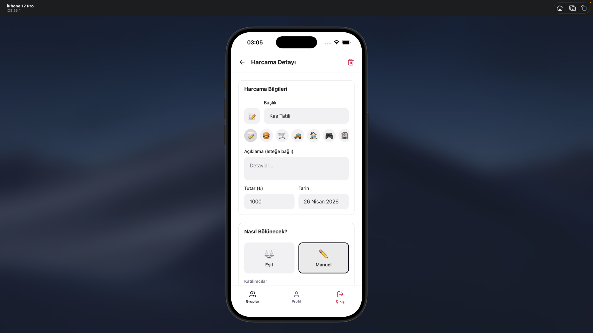

**Gruplar Pull-to-Refresh**

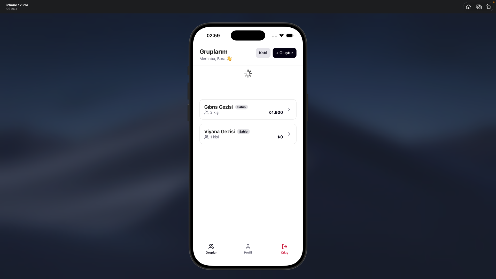

**Toast Bildirimi (Başarılı)**

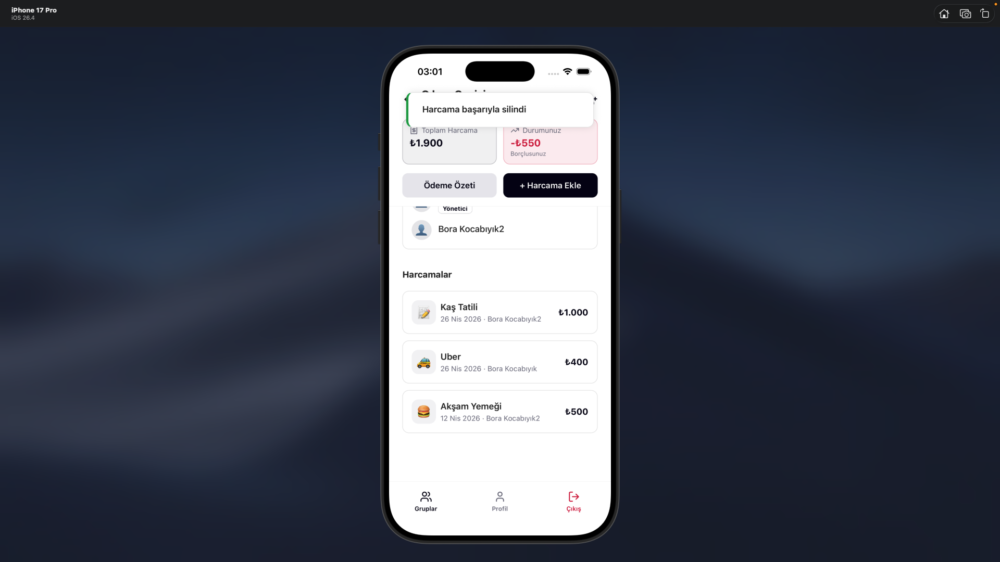

## Hafta 6 — Paylaşım ve Hesaplama

- [x] ExpenseSplit yapısının tamamlanması
- [x] Manuel kişi bazlı tutar dağıtım özelliğinin eklenmesi
- [x] Borç-alacak hesaplama mantığının yazılması
- [x] Grup özet ekranının yapılması

### Ekstra
- [x] **Üye avatarı — pastel renk paleti:** İsim baş harfleri (2 harf, ör. "BK") + `userId` hash'inden deterministik seçilen 10 renk pastel paletten renkli avatar daire; aynı baş harflere sahip kullanıcılar renk farkıyla görsel olarak ayrışır; oturum sahibi üyede `(Sen)` etiketi gösterilir.
- [x] **Üye listesi daralt/genişlet:** Grup detayda varsayılan 3 üye gösterilir; "Tümünü Gör (+N kişi)" / "Daha Az Göster" ile toggle; tüm üyelerin baş harfleri collapsed/expanded durumda tutarlı hesaplanır.
- [x] **Stat kartları tıklanabilir (`PressableCard`):** "Toplam Harcama" kartına basınca harcama listesine scroll edilir; "Durumunuz" kartına basınca ödeme özeti ekranına yönlendirilir; önceki ayrı "Ödeme Özeti" butonu kaldırıldı.
- [x] **Ödeme özeti — "Harcama Dökümüm" bölümü:** Oturum sahibinin dahil olduğu her harcama için kişisel döküm (başlık + toplam tutar, ödedi, payı, net katkı renk kodlu); collapsible kart, varsayılan açık; alt footer'da harcama toplamı.
- [x] **Başlık yazım tutarlılığı:** Settlement ve grup detay ekranlarındaki tüm section / card başlıklar "Her Kelimenin İlk Harfi Büyük" kuralına getirildi; kural `docs/AGENTS.md`'ye eklendi.
- [x] **"Öde" butonu → "Ödendi":** Ödeme onay dialoguna daha açıklayıcı metin eklendi (kayıt amaçlı olduğu vurgusu).
- [x] **Tema seçimi (Sistem / Açık / Koyu):** Profil ekranında `ActionSheetIOS` ile tema seçimi; `app-settings-store` (Zustand + AsyncStorage) ile kalıcı tercih; `useColorScheme` hook store'u okuyacak şekilde güncellendi.
- [x] **Alt çubuk temizleme:** Çıkış butonu alt çubuğundan kaldırıldı, Profil ekranına taşındı.

### Haftalık Notlar

### Video Linki

[Hafta 6 — 03-05-2026](https://youtu.be/FsKxH_ItLFo)

### Ekran Görselleri

**Grup Detay — Renkli Avatarlar, Tıklanabilir Stat Kartları ve Üye Listesi**

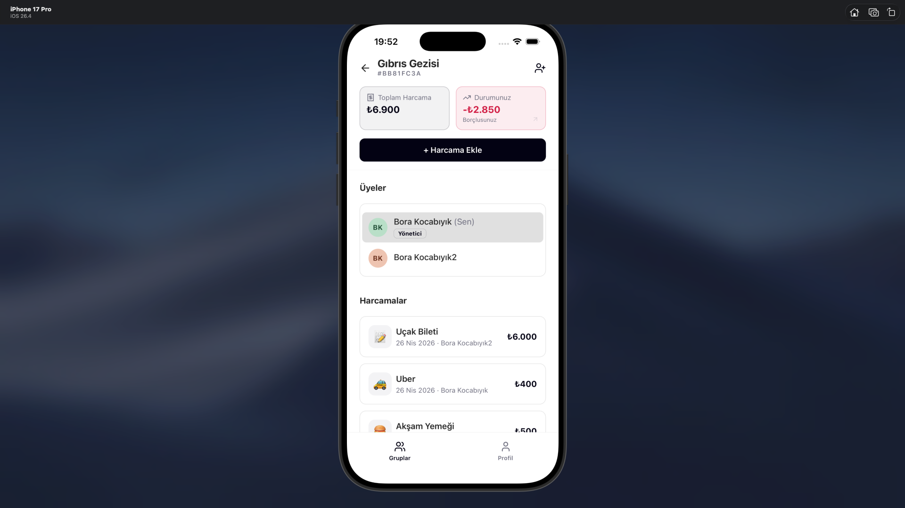

**Ödeme Özeti — Harcama Dökümüm Bölümü**

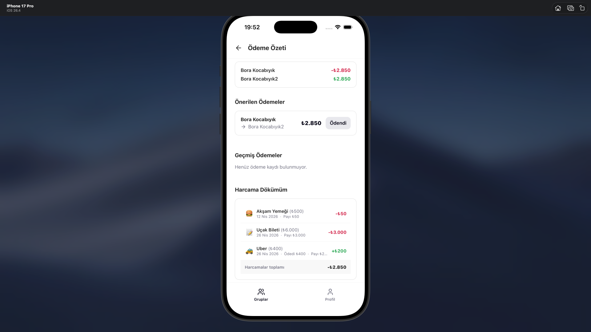

**Profil Ekranı — Tema Seçimi (Açık Mod)**

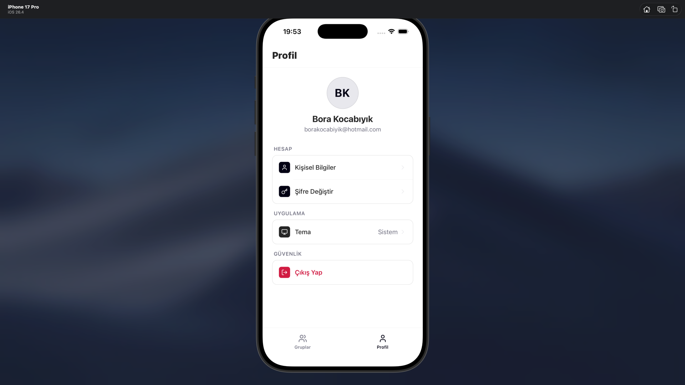

**Tema Seçici — ActionSheet**

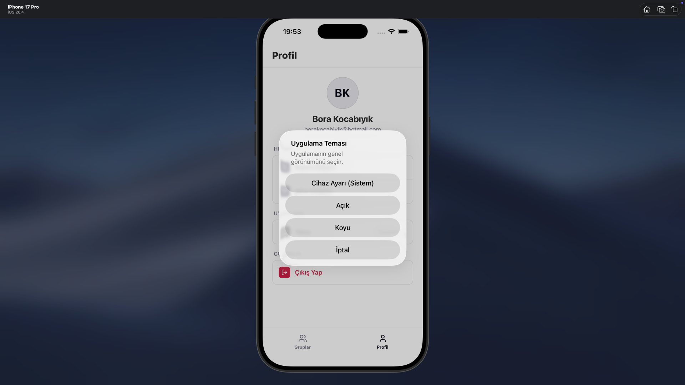

**Profil Ekranı — Koyu Mod**

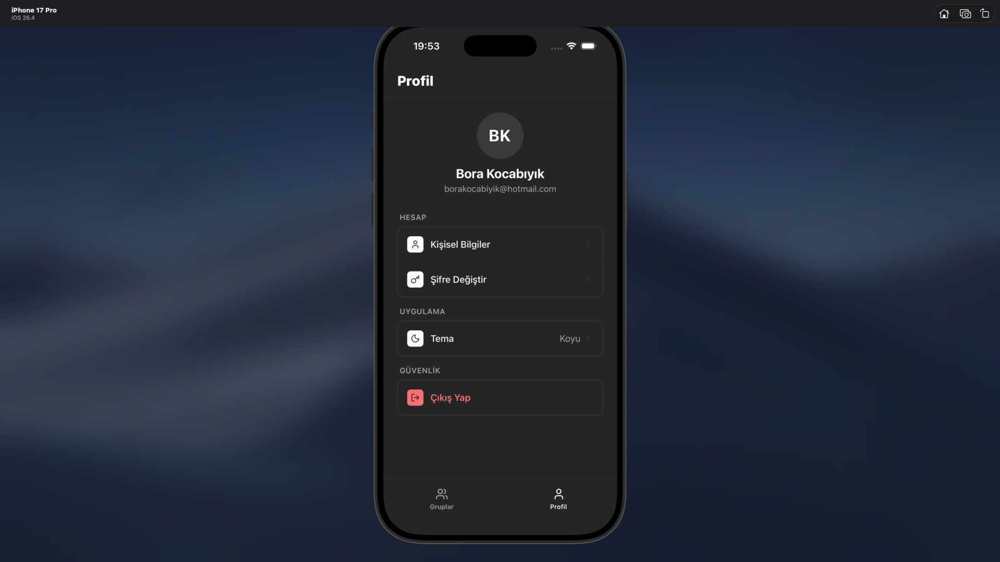

## Hafta 7 — Yerel Veri Saklama ve İyileştirmeler

- [x] Yerel veri saklama yapısının eklenmesi
- [x] Kullanıcı oturumu ve bazı temel verilerin cihaz üzerinde tutulması
- [x] Uygulama açılış performansının iyileştirilmesi
- [x] Form doğrulama ve hata kontrollerinin güçlendirilmesi

### Ekstra
- [x] **Dinamik Kategori/Emoji Haritası (Kullanıcı Alışkanlıklarından Öğrenme):** Sabit kelime sözlüğü kullanmak yerine, açılışta Supabase'den kullanıcıların en çok eşleştirdiği "kelime -> emoji" haritasının çekilip lokal storage'a (MMKV vb.) kaydedilmesi ve harcama eklerken bu dinamik listenin kullanılması.
- [x] **MMKV + Zustand Persist:** `split-data-store` ve `app-settings-store` için MMKV tabanlı Zustand persist altyapısı; açılışta ağ bağlantısı beklenmeden önceki oturumdaki veriler anında gösterilir.
- [x] **Profil düzenleme ekranı:** İsim güncelleme formu (Supabase `auth.updateUser`), canlı avatar önizleme, toast geri bildirim.
- [x] **Şifre değiştirme ekranı:** Mevcut şifre doğrulama (Supabase `signInWithPassword`) + yeni şifre güncelleme; min 6 karakter, eşleşme kontrolü, aynı-şifre engeli.
- [x] **Splash gate optimizasyonu:** Splash screen MMKV rehydrate + auth kontrolü sonrası gizlenir; Supabase sync arka planda non-blocking çalışır.

### Haftalık Notlar

### Video Linki

### Ekran Görselleri

## Hafta 8 — Fiş ve OCR Altyapısı

- [ ] Fiş görseli ekleme altyapısının hazırlanması
- [ ] Supabase Storage ile fiş görseli saklama yapısının kurulması
- [ ] iOS local OCR araştırmasının ve ilk entegrasyonunun yapılması
- [ ] OCR sonucu ile tarih, işletme adı ve toplam tutar alanlarının otomatik doldurulması

### Haftalık Notlar
- **Mimari Karar (Hibrit OCR + LLM):** Fiş okuma işlemi için karmaşık regex/parser yazmak yerine, telefonun yerel OCR yetenekleriyle okunan dağınık metin yığınını (saf text) OpenAI GPT-4o-mini API'sine gönderip JSON (Toplam tutar, kategori vb.) olarak yapılandırılmış çıktı alacağız. Bu sayede sunucu maliyetini inanılmaz düşürürken, fiş formatı ayrıştırma sorununu tamamen çözeceğiz.

### Video Linki

### Ekran Görselleri

## Hafta 9 — OCR Entegrasyonu ve Arayüz

- [ ] OCR akışının harcama oluşturma ekranına bağlanması
- [ ] Fiş toplamı üzerinden otomatik eşit bölüşüm önerisinin yapılması
- [ ] Manuel kişi bazlı paylaştırma ile OCR sonucunun birlikte çalışır hale getirilmesi
- [ ] Arayüz iyileştirmeleri

### Haftalık Notlar

### Video Linki

### Ekran Görselleri

## Hafta 10 — Son Düzenlemeler ve Final

- [ ] Genel hata düzeltmeleri
- [ ] Kod temizliği ve klasör düzeninin son halinin verilmesi
- [ ] Ekranların görsel olarak iyileştirilmesi
- [ ] GitHub üzerindeki açıklamaların toparlanması
- [ ] Final gösterimine uygun stabil sürümün hazırlanması

### Haftalık Notlar

### Video Linki

### Ekran Görselleri

---

React Native + TypeScript ile iOS için geliştirilecek ortak harcama takip uygulaması.

## Teknoloji Yığını

| Katman | Teknoloji |
|--------|-----------|
| Framework | React Native (Expo SDK 55) |
| Dil | TypeScript |
| Platform | iOS (Xcode, iOS Simulator) |
| Backend | Supabase (Auth, PostgreSQL, Storage) |
| Tasarım | Figma |
| OCR | iOS cihaz içi metin tanıma |
| Sürüm Kontrolü | Git & GitHub |

## Veri Modelleri

- **User / Profile** — id, ad, e-posta, oluşturulma tarihi
- **Group** — id, grup adı, açıklama, oluşturulma tarihi, grup sahibi
- **GroupMember** — id, grup id, kullanıcı id, katılım tarihi
- **Expense** — id, grup id, başlık, açıklama, tarih, toplam tutar, ödeyen, paylaşım tipi, fiş görseli, OCR alanları
- **ExpenseSplit** — id, harcama id, kullanıcı id, düşen tutar
- **SettlementSummary** — toplam harcama, kullanıcı bazlı ödenen/düşen, alacaklı/borçlu listesi

---

## Kapsam Dışı (Gelecek Sürüm)

Aşağıdaki özellikler bilinçli olarak ilk sürüm kapsamı dışında bırakılmıştır:

- Android desteği
- Fişteki ürünleri kalem kalem otomatik ayrıştırma
- Gelişmiş YZ destekli fiş analizi
- Gerçek para transferi
- Banka veya kart entegrasyonu
- Tam App Store yayın süreci
