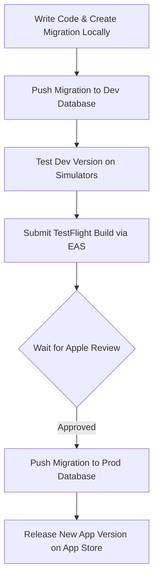

# SplitSnap Development and Deployment Workflow

> [!NOTE]
> This is a persistent developer guide for environment management, migration tracking, and EAS deployment. Keep this in `docs/dev/` for reference.

This document outlines the practical steps a solo developer should follow when managing database schema changes (migrations) in SplitSnap, maintaining separation of environments (Dev vs Prod), and deploying builds to the App Store securely without data loss.

---

## 1. Environment Separation (Dev vs Prod)

Instead of managing local Docker containers, running two distinct Supabase projects is the simplest and most efficient approach for a solo developer:

1.  **`splitsnap` (Production):** The database linked to the live App Store build.
2.  **`splitsnap-dev` (Development):** The free-tier database used for local development, prototyping, and staging.

---

## 2. `.env` and EAS Secrets Configuration

To ensure your local configurations never overwrite the production configuration during EAS Builds, follow this structure:

### Local Development (`.env`)
Always point your local `.env` file to your **Development** database:
```env
EXPO_PUBLIC_SUPABASE_URL=https://splitsnap-dev.supabase.co
EXPO_PUBLIC_SUPABASE_KEY=your-dev-anon-key
```

### Production Build (EAS Secrets)
To automatically override your local `.env` values when building for production:
1.  Navigate to your project settings on the [Expo Dashboard](https://expo.dev).
2.  Go to **Credentials -> Secrets**.
3.  Add the following variables with your **Production** Supabase keys:
    *   `EXPO_PUBLIC_SUPABASE_URL` = `https://splitsnap-production.supabase.co`
    *   `EXPO_PUBLIC_SUPABASE_KEY` = `your-production-anon-key`

> [!TIP]
> During EAS Build, Expo automatically injects these production values into the bundle. Local development (simulators or development client builds) will fallback to your local `.env` file.

---

## 3. Migration and TestFlight Lifecycle Management

Since Apple's review process can take a few days, **Supabase Migration Auto-Tracking** is used to align database schemas with client builds without version conflicts:

### Workflow Diagram



### Step-by-Step Operations

1.  **Create Migration Locally:**
    Create a timestamped migration SQL file using the Supabase CLI:
    ```bash
    npx supabase migration new <feature_name>
    ```
    This generates a timestamped `.sql` file under `supabase/migrations/`. Add your schema modifications to this file.

2.  **Apply to Development:**
    Push the new migration to your dev project reference:
    ```bash
    npx supabase db push --linked-project <splitsnap-dev-project-ref>
    ```

3.  **Submit TestFlight Build:**
    Submit the app to TestFlight. EAS tracks the Git Commit Hash associated with this TestFlight build, allowing you to trace the exact migration files in the repo at that commit.

4.  **Promote to Production (Just Before Release):**
    Once the TestFlight build is approved and you are ready to release it to the App Store, apply the migration files to the production database:
    ```bash
    npx supabase db push --linked-project <splitsnap-production-project-ref>
    ```
    *   **Data Integrity & Conflict Prevention:** The Supabase CLI inspects the `schema_migrations` table in your production database and executes **only** the missing migration scripts in timestamp order. Migrations are never re-run or duplicated, preventing schema corruption.

---

## 4. iOS Toolchain: Simulator (stable Xcode) vs Physical Device (iOS beta)

The two local test targets need **different Xcode toolchains**:

| Target | Toolchain | iOS SDK | Command |
|--------|-----------|---------|---------|
| Simulator | `/Applications/Xcode.app` (stable, the `xcode-select` default) | 26.5 | `npm run ios` |
| Physical iPhone on iOS 27 public beta | `/Applications/Xcode-beta.app` | 27.0 | `npm run ios:device` |

A device running an iOS **beta** can only be deployed to by an Xcode that ships that SDK and the matching device-support files — the stable Xcode tops out at the iOS 26.5 SDK. (Simulator runtimes are the exception: they live in a shared CoreSimulator directory, so both Xcodes see the installed 26.5 **and** 27.0 runtimes.)

Instead of switching the global default back and forth with `sudo xcode-select -s`, `ios:device` overrides the toolchain **per command** via `DEVELOPER_DIR`:

```json
"ios": "expo run:ios",
"ios:device": "DEVELOPER_DIR=/Applications/Xcode-beta.app/Contents/Developer expo run:ios --device"
```

This keeps `npm run ios` (and therefore the simulator flow, EAS, and CI) on the stable toolchain — nothing else in the repo has to know about the beta.

> [!WARNING]
> Plain `npx expo run:ios --device` is **not** equivalent, even if you pick the iOS 27 iPhone from the prompt. Without `DEVELOPER_DIR` the build runs on the stable toolchain and its iOS 26.5 SDK, which cannot deploy to an iOS 27 device. The device still shows up in the picker (the connection list is toolchain-independent), so the failure comes later, during build or install — always go through `npm run ios:device`.

> [!NOTE]
> The `Xcode-beta.app` path is **machine-local**. It is hardcoded because `ios/` is gitignored and generated by prebuild, so this is a personal-workstation setting rather than shared project config. On a machine without Xcode-beta installed, `npm run ios:device` fails while `npm run ios` keeps working.

### Clearing the build cache when switching toolchains

`expo run:ios` does not pass `-derivedDataPath`, so **both** toolchains build into the same shared cache at `~/Library/Developer/Xcode/DerivedData/SplitSnap-<hash>`. The hash is derived from the workspace path, not from the Xcode version, so the stable and beta compilers land in one directory.

Most switches are still fine, because Xcode separates the outputs by platform (`Build/Products/Debug-iphoneos` for the device, `Build/Products/Debug-iphonesimulator` for the simulator). The collisions happen in the shared intermediates and module cache when the **compiler version** changes: Swift module / bridging-header mismatches, "built with a different version of Swift" errors, or link failures that match no recent code change.

When that happens, clear caches cheapest first:

```bash
# 1. The actual compiler cache — usually the fix (several GB, rebuilt on next run)
rm -rf ~/Library/Developer/Xcode/DerivedData/SplitSnap-*

# 2. Still failing? Regenerate the native project, re-running codegen + pod install
npx expo prebuild --clean
```

Note that `ios/build/` is **not** the compiler cache — it only holds React Native codegen and autolinking output, which is toolchain-independent. Deleting it forces codegen to re-run but won't fix a Swift version mismatch.

Nothing here touches tracked files — `ios/` is gitignored, so `prebuild --clean` is always safe to run.
