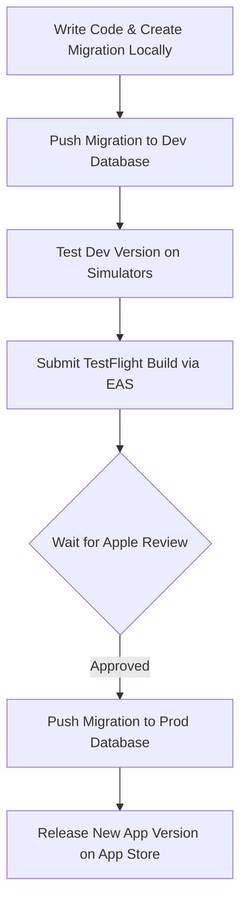

# SplitSnap Development and Deployment Workflow

> [!NOTE]
> Persistent guide for environment management, migration tracking, iOS toolchains, and EAS deployment. Lives at `docs/DEVELOPMENT_WORKFLOW.md` (this path — there is no `docs/dev/` folder).

This document outlines how to manage database schema changes, environments, and App Store builds. **§1–§3 below mix current practice with a target setup** — read the callout in §1 before following any "point `.env` at dev" instruction.

---

## 1. Environment Separation (Dev vs Prod)

> [!WARNING]
> **Current reality (as of 2026-08):** there is **one** hosted Supabase project. Local `.env` points at production. Simulator runs, smoke tests, and screenshot seeding all write live data. Creating `splitsnap-dev` and flipping `.env` is a Sprint #5 item scheduled **after** the v1.2.0 dual-client test pass (see `ROADMAP.md`). Until then:
>
> - App / smoke testing → production, **only** screenshot test accounts (`APP-STORE.md`, `supabase/seed-local/`). Clean up with teardown / manual deletes.
> - Migration / RPC verification → **local Docker** (`supabase start`, `db reset`, SQL under `supabase/tests/` — see `supabase/README.md`). That stack is not what the Expo app uses day to day.
>
> The rest of §1–§3 is the **target** workflow once the second project exists. Do not rewrite this section as if it were already true, and do not skip the warning above when onboarding a new session.

**Target** (not built yet): two hosted projects instead of relying on Docker for daily app work:

1.  **`splitsnap` (Production):** The database linked to the live App Store build.
2.  **`splitsnap-dev` (Development):** Free-tier project for local development, prototyping, and staging.

---

## 2. `.env` and EAS Secrets Configuration

**Today:** `.env` holds the production publishable URL/key. EAS may or may not already override them — verify on the Expo dashboard before assuming a split.

**Target** (after `splitsnap-dev` exists): keep production out of the working tree so a careless `eas build` cannot ship a local `.env` pointed at the wrong place.

### Local Development (`.env`) — target
Point local `.env` at the **Development** database:
```env
EXPO_PUBLIC_SUPABASE_URL=https://splitsnap-dev.supabase.co
EXPO_PUBLIC_SUPABASE_KEY=your-dev-anon-key
```

### Production Build (EAS Secrets) — target
To override local `.env` values when building for production:
1.  Navigate to your project settings on the [Expo Dashboard](https://expo.dev).
2.  Go to **Credentials -> Secrets**.
3.  Add the following variables with your **Production** Supabase keys:
    *   `EXPO_PUBLIC_SUPABASE_URL` = `https://<production-ref>.supabase.co`
    *   `EXPO_PUBLIC_SUPABASE_KEY` = `your-production-anon-key`

> [!TIP]
> During EAS Build, Expo injects secret values into the bundle. Local development (simulators or development client builds) falls back to `.env`.

---

## 3. Migration and TestFlight Lifecycle Management

> [!NOTE]
> **Today's shortcut:** migrations that already shipped for v1.2.0 write-integrity were verified with local `db reset` + the SQL suite, then `supabase db push` to the single hosted project — *before* every installed client matched. That gap is intentional and temporary; closing it is the Sprint #5 client rebuild. Prefer the diagram below once a real dev project exists.

Since Apple's review process can take a few days, **Supabase Migration Auto-Tracking** is used to align database schemas with client builds without version conflicts:

### Workflow Diagram



### Step-by-Step Operations

1.  **Create Migration Locally:**
    Create a timestamped migration SQL file using the Supabase CLI:
    ```bash
    npx supabase migration new <feature_name>
    ```
    This generates a timestamped `.sql` file under `supabase/migrations/`. Add your schema modifications to this file.

2.  **Apply to Development:**
    Push the new migration to your dev project reference:
    ```bash
    npx supabase db push --linked-project <splitsnap-dev-project-ref>
    ```

3.  **Submit TestFlight Build:**
    Submit the app to TestFlight. EAS tracks the Git Commit Hash associated with this TestFlight build, allowing you to trace the exact migration files in the repo at that commit.

4.  **Promote to Production (Just Before Release):**
    Once the TestFlight build is approved and you are ready to release it to the App Store, apply the migration files to the production database:
    ```bash
    npx supabase db push --linked-project <splitsnap-production-project-ref>
    ```
    *   **Data Integrity & Conflict Prevention:** The Supabase CLI inspects the `schema_migrations` table in your production database and executes **only** the missing migration scripts in timestamp order. Migrations are never re-run or duplicated, preventing schema corruption.

---

## 4. iOS Toolchain and Run Targets

There is **one** toolchain: stable **Xcode 27.0** (iOS 27.0 SDK), the `xcode-select` default. It builds for the simulators and for the physical iPhone (on the iOS 27.0 release) alike, so no command needs a `DEVELOPER_DIR` override. The project's line is **iOS 27**: there is no iOS 26 runtime or simulator on the development machine, and no script targets one.

| Target | Command |
|--------|---------|
| **Pick from a list** — every simulator plus the connected iPhone, printed in the terminal on each run | `npm run ios:pick` |
| iOS 27.0 `iPhone 17 Pro Max`, booted for you — the App Store screenshot geometry (1320 × 2868, see [`APP-STORE.md`](./APP-STORE.md)) | `npm run ios:27` |
| Whatever simulator Xcode picks by default, no list | `npm run ios` |

`ios:pick` is the default. In its list the phone carries 🌐 (Wi-Fi) or 🔌 (USB), and a simulator that is already running is shown in bold.

```json
"ios": "expo run:ios",
"ios:pick": "expo run:ios --device",
"ios:27": "./scripts/run-ios-simulator.sh \"iPhone 17 Pro Max\""
```

> [!WARNING]
> **The development build uses the App Store bundle ID** (`dev.borak.splitsnap`). Picking the physical iPhone installs the dev client **over** whatever App Store version is on it. During a dual-client pass (`TEST-PLAN.md`: ESKİ = App Store build on the phone) do not pick the phone. A separate dev bundle ID would let the two coexist; it belongs with the `splitsnap-dev` item in `ROADMAP.md` Sprint #5.

> [!NOTE]
> **Shut-down simulators and `--device`.** Expo builds the list by merging `devicectl`'s devices with `simctl`'s simulators — `devicectl` first, de-duplicated by UDID — and treats every `devicectl` entry as a physical device, installing it through `devicectl`, which only handles a simulator it already sees as connected. On Xcode 26.6 that path was taken for shut-down simulators, and the build succeeded before the install failed with:
>
> ```
> Error: The capability "Install Application" is not supported by this device.
>        (com.apple.dt.CoreDeviceError error 1001)
> ```
>
> Xcode 27's `devicectl` lists only **booted** simulators (checked 2026-09-15), so a shut-down simulator picked in `ios:pick` now arrives through `simctl` and Expo boots it itself. That is read from `@expo/cli`'s source, not yet confirmed by a build: if 1001 comes back, open the simulator first and re-run. `ios:27` boots its target through [`scripts/run-ios-simulator.sh`](../scripts/run-ios-simulator.sh) regardless.
>
> The yellow `Unexpected devicectl JSON version output from devicectl` warning on every `--device` run is cosmetic: Xcode 27 emits `jsonVersion` 5, `@expo/cli` 57 only recognises 2 and 3, and the fields it actually reads are unchanged.

> [!NOTE]
> **If the phone goes back on a beta** (an iOS 28 beta next summer, say), stable Xcode cannot deploy to it. Install Xcode-beta and override the toolchain for that one run rather than switching the global default with `sudo xcode-select -s`: `DEVELOPER_DIR=/Applications/Xcode-beta.app/Contents/Developer npm run ios:pick`. Simulators keep building on stable Xcode. Alternating compilers is when DerivedData needs clearing (see below).

### How Xcode finds Node

Xcode script phases — Hermes and the React Native dependency scripts — run in a sanitised shell with no nvm on `PATH`, so they read `NODE_BINARY` from `ios/.xcode.env.local`. That file is **generated on every prebuild** by [`plugins/withXcodeEnvNvm.js`](../plugins/withXcodeEnvNvm.js), and it resolves Node through nvm from [`.nvmrc`](../.nvmrc) rather than naming a path. Both halves are deliberate:

- **No hardcoded path.** An absolute path here rots silently. A Homebrew revision bump (`node/26.5.0` → `node/26.5.0_1`) or an `nvm install` moves the binary, and the next build fails with `line 9: .../bin/node: No such file or directory`, followed by a cascade of `Internal inconsistency error: never received target ended message for target ID` lines. Those cascades are noise from the aborted parallel build, not separate faults — fix the Node path and they disappear.
- **Generated, not hand-written.** Because `ios/` is gitignored and rebuilt by prebuild, a file edited by hand would vanish on the next `prebuild --clean` and take the build with it. Generating it also means a fresh clone works on the first `npm run ios`.

The point of the indirection is that `.nvmrc` stays the **only** place the Node version is written down. Local shells (`nvm use`), this iOS build, and EAS Build all read it — EAS resolves Node from the build profile's `node` field first, then `.nvmrc`, then the image default, and `eas.json` deliberately sets no `node` field. `engines.node` in `package.json` plus `engine-strict=true` in `.npmrc` back this up by making `npm install` fail outright, rather than warn, when the active Node falls outside the pin.

### Clearing the build cache

`expo run:ios` does not pass `-derivedDataPath`, so every build lands in one shared cache at `~/Library/Developer/Xcode/DerivedData/SplitSnap-<hash>`. The hash is derived from the workspace path, not from the Xcode version, so builds from different compilers land in the same directory.

Switching between simulator and phone is free, because Xcode separates the outputs by platform (`Build/Products/Debug-iphonesimulator` vs `Debug-iphoneos`). The collisions happen in the shared intermediates and module cache when the **compiler version** changes — after an Xcode upgrade, or when alternating with a beta toolchain: Swift module / bridging-header mismatches, "built with a different version of Swift" errors, or link failures that match no recent code change.

When that happens, clear caches cheapest first:

```bash
# 1. The actual compiler cache — usually the fix (several GB, rebuilt on next run)
rm -rf ~/Library/Developer/Xcode/DerivedData/SplitSnap-*

# 2. Still failing? Regenerate the native project, re-running codegen + pod install
npx expo prebuild --clean
```

Note that `ios/build/` is **not** the compiler cache — it only holds React Native codegen and autolinking output, which is toolchain-independent. Deleting it forces codegen to re-run but won't fix a Swift version mismatch.

Nothing here touches tracked files — `ios/` is gitignored, so `prebuild --clean` is always safe to run. It also rewrites `ios/.xcode.env.local` from the config plugin, so the Node setup survives the wipe instead of having to be restored by hand.
