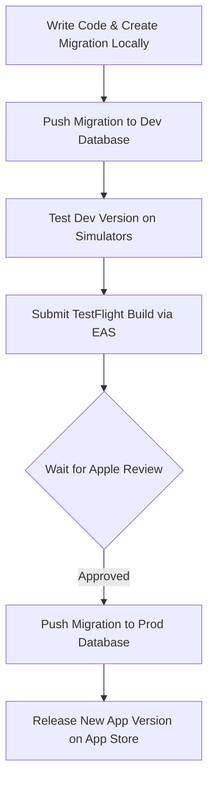

# SplitSnap Development and Deployment Workflow

> [!NOTE]
> This is a persistent developer guide for environment management, migration tracking, and EAS deployment. Keep this in `docs/dev/` for reference.

This document outlines the practical steps a solo developer should follow when managing database schema changes (migrations) in SplitSnap, maintaining separation of environments (Dev vs Prod), and deploying builds to the App Store securely without data loss.

---

## 1. Environment Separation (Dev vs Prod)

Instead of managing local Docker containers, running two distinct Supabase projects is the simplest and most efficient approach for a solo developer:

1.  **`splitsnap` (Production):** The database linked to the live App Store build.
2.  **`splitsnap-dev` (Development):** The free-tier database used for local development, prototyping, and staging.

---

## 2. `.env` and EAS Secrets Configuration

To ensure your local configurations never overwrite the production configuration during EAS Builds, follow this structure:

### Local Development (`.env`)
Always point your local `.env` file to your **Development** database:
```env
EXPO_PUBLIC_SUPABASE_URL=https://splitsnap-dev.supabase.co
EXPO_PUBLIC_SUPABASE_KEY=your-dev-anon-key
```

### Production Build (EAS Secrets)
To automatically override your local `.env` values when building for production:
1.  Navigate to your project settings on the [Expo Dashboard](https://expo.dev).
2.  Go to **Credentials -> Secrets**.
3.  Add the following variables with your **Production** Supabase keys:
    *   `EXPO_PUBLIC_SUPABASE_URL` = `https://splitsnap-production.supabase.co`
    *   `EXPO_PUBLIC_SUPABASE_KEY` = `your-production-anon-key`

> [!TIP]
> During EAS Build, Expo automatically injects these production values into the bundle. Local development (simulators or development client builds) will fallback to your local `.env` file.

---

## 3. Migration and TestFlight Lifecycle Management

Since Apple's review process can take a few days, **Supabase Migration Auto-Tracking** is used to align database schemas with client builds without version conflicts:

### Workflow Diagram



### Step-by-Step Operations

1.  **Create Migration Locally:**
    Create a timestamped migration SQL file using the Supabase CLI:
    ```bash
    npx supabase migration new <feature_name>
    ```
    This generates a timestamped `.sql` file under `supabase/migrations/`. Add your schema modifications to this file.

2.  **Apply to Development:**
    Push the new migration to your dev project reference:
    ```bash
    npx supabase db push --linked-project <splitsnap-dev-project-ref>
    ```

3.  **Submit TestFlight Build:**
    Submit the app to TestFlight. EAS tracks the Git Commit Hash associated with this TestFlight build, allowing you to trace the exact migration files in the repo at that commit.

4.  **Promote to Production (Just Before Release):**
    Once the TestFlight build is approved and you are ready to release it to the App Store, apply the migration files to the production database:
    ```bash
    npx supabase db push --linked-project <splitsnap-production-project-ref>
    ```
    *   **Data Integrity & Conflict Prevention:** The Supabase CLI inspects the `schema_migrations` table in your production database and executes **only** the missing migration scripts in timestamp order. Migrations are never re-run or duplicated, preventing schema corruption.
